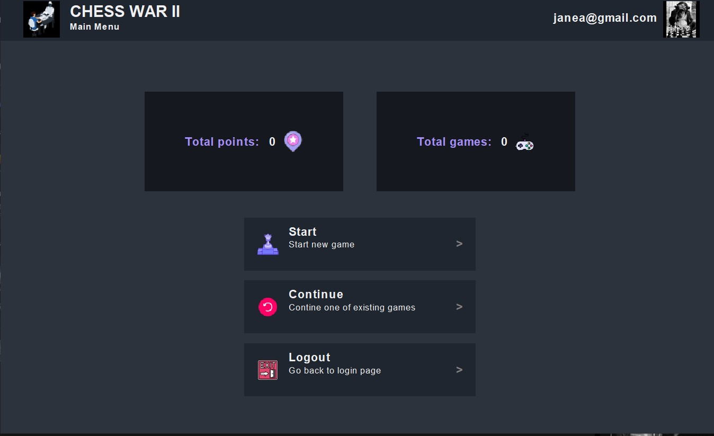
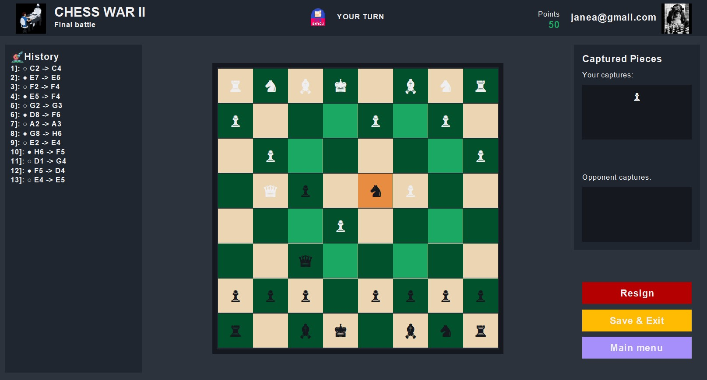

# Java Chess Application


---

## 1. Project Abstract

This document serves as the primary technical reference for a desktop Chess application implemented in Java. The system is architected as a self-contained, monolithic application that provides a complete graphical user interface for playing chess against another human player or a placeholder computer opponent. The application encompasses user authentication, game state persistence, move history tracking, and full implementation of standard chess rules including check detection, checkmate resolution, and pawn promotion.

The fundamental engineering problem addressed by this system is the encapsulation of complex game logic, stateful user interaction, and data management within a single, deployable executable. Unlike client-server or web-based architectures, this application operates entirely within a single process on the user's local machine. This architectural constraint eliminates network latency concerns, simplifies deployment to a single JAR distribution, and removes the operational overhead of maintaining server infrastructure.

The system adheres to object-oriented design principles, employing the **Observer Pattern** for event-driven communication between the game engine and UI components, and the **Strategy Pattern** for polymorphic piece movement logic. These patterns were selected to promote separation of concerns within the constraints of a monolithic codebase, enabling independent modification of UI rendering, game rules, and persistence mechanisms.

The target deployment environment is any system with a Java Runtime Environment (JRE) version 8 or higher. The application has been validated on Windows 10/11, macOS, and common Linux distributions. No external services, network connectivity, or database installations are required for operation.

---

## 2. Technical Specification and Technology Justification

This section documents the technology stack and provides engineering justification for each component. The project intentionally minimizes external dependencies, favoring standard library components and a single, well-understood JSON parsing library.

### 2.1 Programming Language: Java 8+

**Selection Rationale:** Java was selected as the implementation language for several technical reasons. First, its strong static typing system provides compile-time guarantees that are particularly valuable in a logic-intensive domain such as chess, where move validation and board state management require precise type contracts. Second, Java's platform independence via the Java Virtual Machine (JVM) ensures that the compiled bytecode executes identically across Windows, macOS, and Linux without modification. Third, the mature ecosystem provides robust standard library support for collections, I/O operations, and GUI components, reducing the need for external dependencies.

**Alternative Consideration:** Modern alternatives such as Kotlin or Scala were considered but rejected. While these languages offer syntactic improvements and functional programming features, they would introduce additional compilation complexity and potential compatibility issues without providing significant architectural benefits for this application's scope. The project's educational context also favored Java's widespread adoption in academic curricula.

### 2.2 GUI Framework: Java Swing (JFC)

**Selection Rationale:** The graphical user interface is implemented using the Java Swing framework, part of the Java Foundation Classes (JFC) included in the standard JDK. This selection was driven by three primary factors:

1. **Zero External Dependencies:** Swing requires no additional library downloads or classpath configuration. Any system with a JDK/JRE can compile and execute the application without dependency resolution.

2. **Deterministic Rendering:** Unlike web-based interfaces that depend on browser rendering engines, Swing provides consistent visual output across platforms, which is critical for precise positioning of chess pieces on the 8x8 grid.

3. **Event-Driven Architecture:** Swing's listener-based event model integrates naturally with the Observer pattern used in the game engine, allowing UI components to register as observers and receive notifications of game state changes.

**Alternative Consideration:** JavaFX was evaluated as a more modern alternative. While JavaFX offers improved styling via CSS and scene graph rendering, it is no longer bundled with the JDK as of Java 11, requiring separate dependency management. For a project prioritizing minimal external dependencies, Swing remains the pragmatic choice.

### 2.3 Data Persistence: JSON Files via json-simple

**Selection Rationale:** Application state, including user accounts and saved games, is persisted to local JSON files. The `json-simple` library (version 1.1.1) handles serialization and deserialization. This approach was selected for the following reasons:

1. **Human-Readable Format:** JSON files can be manually inspected and edited, facilitating debugging during development and allowing users to examine their saved data.

2. **No Server Requirement:** Unlike database solutions (PostgreSQL, MongoDB, SQLite), file-based storage requires no installation, configuration, or background services.

3. **Adequate Performance:** For the expected data volume (dozens of user accounts, hundreds of saved games), file I/O latency is negligible compared to the human interaction time between moves.

**Trade-off Acknowledgment:** This approach sacrifices ACID guarantees. If the application terminates unexpectedly during a write operation, data corruption is possible. A production-grade implementation would employ write-ahead logging or atomic file replacement (write to temporary file, then rename) to mitigate this risk.

### 2.4 Build System: Manual Compilation with Makefile/PowerShell Automation

**Selection Rationale:** The project eschews formal build tools such as Maven or Gradle in favor of direct `javac` compilation. This decision reflects the project's minimal dependency footprint—a single external JAR file does not justify the configuration overhead of a full build tool. To automate the compilation process, the project provides:

- **Makefile:** For Linux, macOS, and Windows Subsystem for Linux (WSL) environments.
- **build.ps1:** A PowerShell script for native Windows environments.

Both scripts encapsulate the classpath configuration required to include the `json-simple` library, eliminating the need for users to manually construct complex command-line arguments.

---

## 3. System Visualization

This section presents visual documentation of the application's user interface, with technical analysis of the component hierarchy and user interaction flow.

### Figure 1: Authentication Module

<p align="center">
  
</p>

**Component Analysis:** Figure 1 demonstrates the `LoginAndRegisterWindow` class, a `JFrame` subclass that serves as the application's entry point. The interface presents a dual-panel layout implemented using Swing's `CardLayout` manager, allowing seamless transition between login and registration forms without instantiating additional windows. The form components utilize custom-styled `JTextField` and `JPasswordField` elements defined in the `CustomGeneral_Components` subpackage. User input validation occurs synchronously upon form submission, with error feedback rendered via `JOptionPane` dialogs. Successful authentication triggers instantiation of the `MainMenuFrame` and disposal of the login window.

### Figure 2: Main Navigation Hub

<p align="center">
  
</p>

**Component Analysis:** Figure 2 presents the `MainMenuFrame` class, the central navigation component of the application. The interface employs a vertical `BoxLayout` to arrange navigation buttons, each implemented as instances of `MainMenuClickButton` with custom hover and click event styling. The "New Game" action triggers instantiation of a `Game` object with default parameters, while "Continue Game" queries the `Main` singleton for the current user's active game list. The "Logout" action invokes `Main.getInstance().setCurrentUser(null)` and reconstructs the `LoginAndRegisterWindow`. The frame maintains a reference to the `Main` singleton to access user session state and the game repository.

### Figure 3: Active Game Board

<p align="center">
  
</p>

**Component Analysis:** Figure 3 displays the `GameFrame` class during active gameplay. The chess board is rendered as an 8x8 grid of `ChessButton` instances, each extending `JButton` with custom painting logic to display piece icons and highlight valid move destinations. The right panel contains player information, captured pieces display, and move history scrolling list. The bottom action bar provides "Resign," "Save & Exit," and "Main Menu" controls. Mouse click events on board squares are processed by a centralized `MouseAdapter` that delegates to `Game.turnManager()` for move validation and execution. Upon successful move completion, the `Game` object invokes `notifyObservers()`, triggering UI refresh via the registered `GUIObserver` instance.

---

## 4. Architectural Deep Dive

This section provides detailed analysis of the design patterns employed in the system, including implementation specifics and adherence to SOLID principles.

### 4.1 Observer Pattern Implementation

The Observer pattern is the primary mechanism for decoupling the game engine from UI and logging components. The pattern is implemented through the `GameObserver` interface and its concrete implementations.

**Interface Contract:**

```java
public interface GameObserver {
    void onMoveMade(Move move);
    void onPieceCaptured(Piece piece);
    void onPlayerSwitch(Player currentPlayer);
}
```

The `Game` class maintains a list of registered observers and provides registration methods:

```java
public class Game {
    private List<GameObserver> gameObservers;
    
    public void addObserver(GameObserver observer) {
        this.gameObservers.add(observer);
    }
    
    public void removeObserver(GameObserver observer) {
        this.gameObservers.remove(observer);
    }
    
    private void triggerMoveObservers(Move move) {
        for (GameObserver observer : gameObservers) {
            observer.onMoveMade(move);
        }
    }
}
```

**Observer Implementations:**

| Class | Responsibility |
|-------|----------------|
| `GUIObserver` | Logs move events to console; intended for UI refresh coordination |
| `HistoryObserver` | Maintains in-memory move history for display |
| `PointsObserver` | Recalculates player scores based on captured pieces |
| `JsonLogObserver` | Appends game events to a JSON log file |

**Data Flow:** When a player executes a move, the following sequence occurs:

1. `GameFrame` captures click event and invokes `Game.turnManager(from, to)`
2. `Game` validates the move via `Board.isValidMove()` and executes it
3. `Game` constructs a `Move` object and invokes `triggerMoveObservers(move)`
4. Each registered observer's `onMoveMade()` method is invoked synchronously
5. Observers update their respective state (UI components, logs, scores)

**Architectural Constraint:** The current implementation invokes observers synchronously on the Event Dispatch Thread (EDT). For long-running observer operations, this could block UI responsiveness. A production implementation might employ `SwingWorker` or an asynchronous event bus.

### 4.2 Strategy Pattern for Piece Movement

The Strategy pattern enables polymorphic movement logic, allowing each piece type to define its valid moves without modifying the core game engine. This adheres to the Open/Closed Principle: the system is open for extension (new piece types) but closed for modification (existing code requires no changes).

**Interface Contract:**

```java
public interface MoveStrategy {
    List<Position> getPossibleMoves(Board board, Position from);
}
```

Each piece type has a corresponding strategy implementation in the `pieces_moveStrategies` subpackage:

| Piece | Strategy Class | Movement Logic |
|-------|----------------|----------------|
| King | `KingMoveStrategy` | One square in any direction, with castling detection |
| Queen | `QueenMoveStrategy` | Combines Rook and Bishop logic (orthogonal + diagonal) |
| Rook | `RookMoveStrategy` | Unlimited orthogonal movement until obstruction |
| Bishop | `BishopMoveStrategy` | Unlimited diagonal movement until obstruction |
| Knight | `KnightMoveStrategy` | L-shaped movement (2+1 squares), ignores obstructions |
| Pawn | `PawnMoveStrategy` | Forward movement, diagonal capture, en passant |

**Example Implementation (Knight):**

```java
public class KnightMoveStrategy implements MoveStrategy {
    public List<Position> getPossibleMoves(Board board, Position from) {
        List<Position> possibleMoves = new ArrayList<>();
        int[] OX = {1, 2, 2, 1, -1, -2, -2, -1};
        int[] OY = {2, 1, -1, -2, -2, -1, 1, 2};
        
        Piece pieceAt = board.getPieceAt(from);
        for (int i = 0; i < 8; i++) {
            char x = (char)(from.getX() + OX[i]);
            int y = from.getY() + OY[i];
            
            if (x < 'A' || x > 'H' || y < 1 || y > 8) continue;
            
            Piece target = board.getPieceAt(new Position(x, y));
            if (target == null || !target.getColor().equals(pieceAt.getColor())) {
                possibleMoves.add(new Position(x, y));
            }
        }
        return possibleMoves;
    }
}
```

The Knight's L-shaped movement is encoded via offset arrays `OX` and `OY`, representing the eight possible landing squares. The strategy validates board boundaries and prevents capturing friendly pieces.

### 4.3 Factory Pattern for Piece Instantiation

The `PieceFactoryPattern` class centralizes piece creation, providing a single point of modification for piece instantiation logic:

```java
public static Piece createPiece(Enums.PiecesTypes type, Enums.Colors color, Position position) {
    switch (type) {
        case KING:   return new King(color, position);
        case QUEEN:  return new Queen(color, position);
        case PAWN:   return new Pawn(color, position);
        case BISHOP: return new Bishop(color, position);
        case ROOK:   return new Rook(color, position);
        case KNIGHT: return new Knight(color, position);
        default:     return null;
    }
}
```

This factory also handles pawn promotion, validating that only legal promotion targets (Queen, Rook, Bishop, Knight) are permitted.

---

## 5. Package-Level Documentation

### 5.1 Package: `main_package`

**Purpose:** Application entry point and global state management.

| Class | Responsibility |
|-------|----------------|
| `Main` | Singleton controller managing user sessions, game repository, and persistence orchestration. Provides `read()` and `write()` methods for JSON serialization. |
| `JsonReaderUtil` | Deserializes `accounts.json` and `games.json` into domain objects. Handles malformed data gracefully with null checks and validation. |

**Critical Note:** The `Main` singleton acts as a service locator, which creates implicit dependencies throughout the codebase. Refactoring toward dependency injection would improve testability.

### 5.2 Package: `game_logic`

**Purpose:** Core chess engine, including board state and game orchestration.

| Class | Responsibility |
|-------|----------------|
| `Board` | Maintains piece positions using a `TreeSet<ChessPair<Position, Piece>>`. Provides `getPieceAt()`, `placePieceAt()`, `removePiece()`, and move validation methods. |
| `Game` | Orchestrates gameplay: turn management, player switching, check/checkmate detection, and observer notification. |
| `Move` | Immutable value object representing a single move (from, to, captured piece). |
| `Position` | Value object representing a board coordinate (column A-H, row 1-8). |
| `ChessPair` | Generic key-value pair for associating positions with pieces. |

**State Management:** The `Board` class uses a `TreeSet` with custom ordering to maintain deterministic iteration order. This facilitates consistent JSON serialization and board display rendering.

### 5.3 Package: `pieces_details`

**Purpose:** Chess piece domain models and movement logic.

| Class | Responsibility |
|-------|----------------|
| `Piece` | Abstract base class defining common properties (color, position) and caching validated moves. |
| `King`, `Queen`, `Rook`, `Bishop`, `Knight`, `Pawn` | Concrete piece implementations, each delegating movement logic to its corresponding `MoveStrategy`. |
| `PieceFactoryPattern` | Factory for piece instantiation and type conversion utilities. |

**Subpackage: `pieces_moveStrategies`**

Contains `MoveStrategy` implementations for each piece type, as detailed in Section 4.2.

### 5.4 Package: `GUI_Components`

**Purpose:** Swing-based user interface components.

| Class | Responsibility |
|-------|----------------|
| `GameFrame` | Primary game window (869 lines). Manages board rendering, click event handling, captured pieces display, and move history. |
| `LoginAndRegisterWindow` | Dual-panel authentication form with validation logic. |
| `MainMenuFrame` | Navigation hub with game selection and logout functionality. |
| `LoadingComponent` | Splash screen with timed transition. |

**Subpackage: `CustomGeneral_Components`**

Contains reusable styled components: `ChessButton`, `ClickButton`, `CustomLabel`, `CustomContainer`, and `Global_Style` (centralized theming constants).

### 5.5 Package: `user_details`

**Purpose:** User and player domain models.

| Class | Responsibility |
|-------|----------------|
| `User` | Represents an authenticated user account with email, password, points, and active game references. |
| `Player` | Represents a participant in a specific game, with piece color assignment, captured pieces list, and move execution logic. |

### 5.6 Package: `Interfaces`

**Purpose:** Contract definitions for polymorphic behavior.

| Interface | Implementors |
|-----------|--------------|
| `ChessPiece` | All piece classes (`King`, `Queen`, etc.) |
| `GameObserver` | `GUIObserver`, `HistoryObserver`, `PointsObserver`, `JsonLogObserver` |
| `MoveStrategy` | All strategy classes in `pieces_moveStrategies` |
| `PointsStrategy` | `GamePointsStrategies` |

### 5.7 Package: `errors`

**Purpose:** Domain-specific exception types.

| Exception | Usage |
|-----------|-------|
| `InvalidMoveException` | Thrown when a move violates chess rules |
| `InvalidDataInput` | Thrown for malformed user input |
| `InvalidCommandException` | Reserved for CLI command parsing |
| `WrongPiecePromotion` | Thrown when promoting to invalid piece type |

### 5.8 Package: `misc`

**Purpose:** Utility classes and enumerations.

| Class | Responsibility |
|-------|----------------|
| `Enums` | Defines `Colors` (WHITE, BLACK) and `PiecesTypes` enumerations |
| `JsonWriterUtil` | Serializes domain objects to JSON format |
| `Pair` | Generic tuple utility class |

---

## 6. Build System and Installation Protocol

### 6.1 Prerequisites

- Java Development Kit (JDK) version 8 or higher
- One of the following:
  - GNU Make (Linux, macOS, WSL)
  - PowerShell 5.1+ (Windows)

### 6.2 Build Targets (Makefile)

The provided `Makefile` supports the following targets:

| Target | Command | Description |
|--------|---------|-------------|
| `all` | `make` or `make all` | Compiles all source files to `out/` directory |
| `compile` | `make compile` | Explicit compilation target |
| `run` | `make run` | Compiles and launches the GUI application |
| `test` | `make test` | Compiles and launches the test harness |
| `clean` | `make clean` | Removes all compiled artifacts |
| `help` | `make help` | Displays usage information |

**Classpath Handling:** The Makefile automatically constructs the classpath to include `lib/json-simple-1.1.1.jar`, eliminating manual configuration.

### 6.3 Build Actions (PowerShell)

For Windows environments without GNU Make:

| Action | Command | Description |
|--------|---------|-------------|
| `compile` | `.\build.ps1 compile` | Compiles all source files |
| `run` | `.\build.ps1 run` | Compiles and launches GUI |
| `test` | `.\build.ps1 test` | Compiles and launches test harness |
| `clean` | `.\build.ps1 clean` | Removes compiled artifacts |

### 6.4 Manual Compilation

For environments without Make or PowerShell, direct `javac` commands may be used:

**Linux/macOS:**
```bash
javac -d out -cp "lib/json-simple-1.1.1.jar" -sourcepath src $(find src -name '*.java')
java -cp "out:lib/json-simple-1.1.1.jar" main_package.Main
```

**Windows (Command Prompt):**
```cmd
dir /s /b src\*.java > sources.txt
javac -d out -cp "lib\json-simple-1.1.1.jar" -sourcepath src @sources.txt
java -cp "out;lib\json-simple-1.1.1.jar" main_package.Main
```

---

## 7. Test Harness Analysis

The `Testare.ChessTestRunner` class provides an interactive console-driven test harness for manual verification of application components. It is important to clarify that this is **not a headless unit test suite**—it instantiates Swing components and requires a graphical display environment.

### 7.1 Test Harness Architecture

The test runner presents a menu-driven interface:

```
Teste Manuale SAH
1.Deschidere 2.Loading 3.Register 4.Login 5.MainMenu
6.Board 7.Captura 8.Sah 9.SahMat 10.Promovare 0.Iesire
```

Each option instantiates specific GUI components with pre-configured board states to verify visual rendering and interaction logic.

### 7.2 Test Scenarios

| Option | Method | Purpose |
|--------|--------|---------|
| 1 | `testDeschidereAplicatie()` | Verifies `LoginAndRegisterWindow` instantiation and disposal |
| 2 | `testLoadingComponent()` | Validates timed splash screen transition |
| 3 | `testRegister()` | Tests user registration workflow with persistence verification |
| 4 | `testLogin()` | Validates authentication against existing accounts |
| 5 | `testMainMenuButtons()` | Verifies navigation button functionality |
| 6 | `testBoardInitial()` | Confirms standard 32-piece initial board configuration |
| 7 | `testCapturaCalSelectat()` | Demonstrates knight capture mechanics with pre-positioned pieces |
| 8 | `testSahPeUser()` | Presents a check scenario requiring defensive move |
| 9 | `testSahMat()` | Presents a checkmate-in-one scenario for verification |
| 10 | `testPromovarePion()` | Demonstrates pawn promotion at the eighth rank |

### 7.3 Limitations

The test harness requires a graphical environment; it cannot execute in headless CI/CD pipelines. A production test suite would require:

1. Extraction of game logic into a testable service layer
2. Mock implementations of `GameObserver` for verification
3. JUnit or TestNG integration for automated assertions

---

## 8. Data Persistence and File Management

### 8.1 Data Files

| File | Purpose | Format |
|------|---------|--------|
| `src/input/accounts.json` | User account database | JSON array of user objects |
| `src/input/games.json` | Saved game state database | JSON array of game objects |

### 8.2 JSON Schema: User Account

```json
{
  "email": "user@example.com",
  "password": "plaintext_password",
  "points": 100,
  "games": [1, 2, 5]
}
```

### 8.3 JSON Schema: Game State

```json
{
  "id": 1,
  "players": [
    {"email": "player1@example.com", "color": "WHITE", "points": 0},
    {"email": "computer", "color": "BLACK", "points": 0}
  ],
  "currentPlayerColor": "WHITE",
  "board": [
    {"type": "R", "color": "WHITE", "position": "A1"},
    {"type": "N", "color": "WHITE", "position": "B1"}
  ],
  "moves": [
    {"playerColor": "WHITE", "from": "E2", "to": "E4"}
  ]
}
```

### 8.4 Version Control Considerations

The `.gitignore` configuration excludes runtime data files to prevent committing user-specific data:

```
src/input/accounts.json
src/input/games.json
```

Empty seed files (`accounts.json.example`, `games.json.example`) are provided for repository bootstrapping. New clones should copy these files:

```bash
cp src/input/accounts.json.example src/input/accounts.json
cp src/input/games.json.example src/input/games.json
```

---

## 9. Engineering Roadmap and Technical Debt

### 9.1 Identified Technical Debt

| Issue | Severity | Remediation |
|-------|----------|-------------|
| Non-atomic JSON writes | High | Implement write-to-temp-then-rename pattern |
| Plaintext password storage | Critical | Integrate BCrypt or PBKDF2 hashing |
| Singleton `Main` class | Medium | Refactor to dependency injection |
| Observer no-ops in `GUIObserver` | Low | Complete implementation or remove stub |
| Hardcoded file paths | Low | Use `System.getProperty("user.dir")` or resource streams |

### 9.2 Future Enhancement Candidates

1. **AI Opponent via Minimax Algorithm:** Implement alpha-beta pruning search with configurable depth for single-player mode. The `Player` class would be extended with an `AIPlayer` subclass that overrides `makeMove()` to invoke the search algorithm.

2. **Multithreaded Move Calculation:** Offload expensive check/checkmate computation to background threads using `SwingWorker`. This prevents UI freeze during complex board state evaluation.

3. **Network Multiplayer:** Abstract the `Player` interface to support remote players via socket or WebSocket communication. This would require extracting the game protocol into a serializable message format.

4. **Internationalization (i18n):** Extract all user-facing strings to `ResourceBundle` properties files for localization support. The current implementation contains hardcoded Romanian and English strings.

5. **Unit Test Coverage:** Introduce JUnit 5 tests for `Board`, `Game`, and strategy classes with mocked dependencies. Target 80% code coverage for the `game_logic` package.

6. **Undo/Redo Functionality:** Implement the Command pattern to encapsulate moves as reversible operations, enabling game replay and move retraction.

---

## 10. License and Attribution

This project is licensed under the MIT License. See the `LICENSE` file for complete terms.

**Author:** Iazinschi Mihail  
**Context:** Object-Oriented Programming — University Project

---

## 11. References

- Oracle Java SE 8 Documentation: https://docs.oracle.com/javase/8/docs/
- Java Swing Tutorial: https://docs.oracle.com/javase/tutorial/uiswing/
- json-simple Library: https://github.com/fangyidong/json-simple
- Design Patterns: Elements of Reusable Object-Oriented Software (Gamma, Helm, Johnson, Vlissides, 1994)
- Effective Java, Third Edition (Bloch, 2018)
